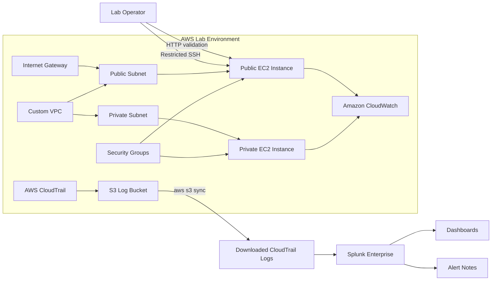

# AWS Hybrid Cloud Security Lab

## Overview

This project demonstrates a hands-on AWS security lab built to model a small hybrid-style cloud environment with segmented networking, monitored workloads, and cloud activity analysis. The lab focuses on a common cloud security problem: infrastructure can be deployed with basic access controls, but defenders still need centralized visibility to understand changes, failed actions, identity activity, and exposed services.

The environment uses a custom AWS VPC with public and private subnets, EC2 instances, security groups, CloudTrail, CloudWatch, S3 log storage, AWS CLI automation, and Splunk Enterprise for SIEM-style analysis. The repository includes setup notes, security analysis notes, detection queries, dashboard documentation, and AWS/Splunk screenshots that show the lab being built and validated.

The final lab demonstrates both prevention and detection thinking: network segmentation limits exposure, CloudTrail captures AWS API activity, Splunk dashboards make activity easier to review, and the findings identify where additional logging and hardening would be needed for stronger security operations.

## Key Features

- Built a custom AWS VPC with public and private subnets to demonstrate network segmentation.
- Deployed public and private EC2 instances to validate exposure boundaries.
- Configured route tables, an Internet Gateway, and security groups.
- Restricted SSH access to the public EC2 instance by source IP.
- Kept the private EC2 instance without direct public internet exposure.
- Enabled CloudTrail and reviewed AWS API activity.
- Used CloudWatch for basic EC2 metrics and environment visibility.
- Retrieved CloudTrail logs from S3 using AWS CLI automation.
- Imported CloudTrail JSON logs into Splunk Enterprise.
- Parsed nested CloudTrail records using `spath` and `mvexpand`.
- Built Splunk dashboards for AWS API activity, EC2 events, failed actions, and trends.
- Created alerting notes for failed API calls, EC2 state changes, and security group changes.
- Documented gaps around host-level logging, SSH visibility, and network flow visibility.

## Architecture

The lab starts with a segmented AWS network. A public subnet hosts an internet-accessible EC2 instance for web validation, while a private subnet hosts an internal EC2 instance without direct public exposure. AWS CloudTrail records control-plane activity and stores logs in S3. Those logs are downloaded with AWS CLI and analyzed in Splunk Enterprise, where searches, dashboards, and alerts provide security visibility.

## Tools & Technologies

### Cloud / Infrastructure

- AWS VPC
- Public and private subnets
- Internet Gateway
- Route tables
- EC2
- Security Groups
- Amazon S3

### Security Tools

- AWS CloudTrail
- Splunk Enterprise
- Splunk Search Processing Language
- Nmap validation notes

### Programming / Scripting

- AWS CLI
- Shell-based log retrieval with `aws s3 sync`
- JSON parsing in Splunk

### Monitoring / Logging

- Amazon CloudWatch EC2 metrics
- CloudTrail event history
- S3-based CloudTrail log storage
- Splunk dashboards and alerts

### Automation / CI/CD

- AWS CLI automation for repeatable CloudTrail log collection
- No CI/CD pipeline is included in this lab

## Security Concepts Demonstrated

This project demonstrates network segmentation, least privilege access, cloud logging, SIEM integration, detection engineering, and security gap analysis. The AWS portion shows how subnet placement, route tables, public IP assignment, and security groups affect exposure.

The monitoring portion shows how CloudTrail can capture AWS control-plane activity, while also highlighting its limitations. CloudTrail is useful for API activity and identity attribution, but it does not capture host-level events such as SSH sessions, shell commands, failed OS logins, or process activity.

The Splunk portion demonstrates practical SIEM work: ingesting CloudTrail logs, parsing nested JSON, writing detection searches, building dashboards, and identifying monitoring gaps that would matter in a real security operations workflow.

## Implementation Steps

1. Created a custom AWS VPC.
2. Added public and private subnets.
3. Configured route tables and an Internet Gateway.
4. Deployed public and private EC2 instances into separate network segments.
5. Configured security groups to limit inbound access.
6. Validated public web access over HTTP.
7. Confirmed the private instance was not directly internet-accessible.
8. Enabled CloudTrail to capture AWS API activity.
9. Reviewed CloudTrail event history and CloudWatch EC2 metrics.
10. Retrieved CloudTrail logs from S3 using AWS CLI.
11. Uploaded and parsed CloudTrail logs in Splunk.
12. Built dashboard panels for API activity, EC2 activity, failed actions, and service trends.
13. Documented key findings, visibility gaps, and security recommendations.

## Results / Findings

The project produced a working AWS infrastructure lab and a SIEM workflow for reviewing CloudTrail activity in Splunk. Screenshots show the VPC, subnets, route tables, Internet Gateway, public/private EC2 placement, public web validation, Splunk dashboard views, and alert overview.

Splunk analysis showed common AWS API activity such as `DescribeAlarms`, `DescribeAddresses`, `DescribeSecurityGroups`, and `GetBucketLogging`. It also identified failed API behavior, including `GetInsightSelectors` returning `InsightNotEnabledException`, which demonstrated how configuration errors or failed actions can be surfaced through SIEM searches.

The lab also identified important visibility gaps. CloudTrail provided strong AWS control-plane visibility, but it did not capture SSH login attempts, OS-level commands, or network scan details. The project therefore recommends adding host-level logs, VPC Flow Logs, Systems Manager Session Manager, and centralized endpoint telemetry.

## Screenshots

Existing screenshots in this repository:

- `screenshots/aws/vpc-overview.png`
- `screenshots/aws/subnets.png`
- `screenshots/aws/route-tables.png`
- `screenshots/aws/internet-gateway.png`
- `screenshots/aws/public-instance-overview.png`
- `screenshots/aws/private-instance-overview.png`
- `screenshots/aws/public-web-sg.png`
- `screenshots/aws/web-server-page.png`
- `screenshots/aws/nmap-scan.png`
- `siem-project/siem/splunk-dashboards.png`
- `siem-project/siem/alerts-overview.png`
- `siem-project/siem/ec2-activity.png`
- `siem-project/siem/failed-actions.png`
- `siem-project/siem/activity-timechart.png`

Suggested additional screenshots:

- `screenshots/architecture.png`
- `screenshots/aws/cloudtrail-event-history.png`
- `screenshots/aws/s3-cloudtrail-logs.png`
- `screenshots/splunk/log-ingestion.png`

## Challenges & Lessons Learned

- Segmentation reduces exposure, but monitoring must be added to detect misuse.
- CloudTrail logs require parsing before they become useful for event-level Splunk analysis.
- Failed API calls can reveal configuration issues or suspicious attempts.
- Public SSH should be reduced or replaced with AWS Systems Manager Session Manager where possible.
- Cloud-native logs need to be paired with host and network telemetry for stronger detection coverage.

## Relevance to Security Roles

This project maps well to Security Engineer, Cloud Security Analyst, SOC Analyst, and Detection Engineer responsibilities. It shows practical AWS network design, exposure validation, CloudTrail analysis, SIEM ingestion, dashboard creation, and security recommendations.

It is also relevant to DevSecOps and cloud operations roles because it demonstrates secure design decisions, repeatable AWS CLI workflows, and clear documentation of visibility gaps.

## Future Improvements

- Replace direct SSH access with AWS Systems Manager Session Manager.
- Enable VPC Flow Logs for network-level visibility.
- Add host-level logging from EC2 instances.
- Forward logs automatically instead of manually uploading downloaded CloudTrail files.
- Add separate `.spl` files for detection queries.
- Add sanitized CloudTrail sample logs.
- Add Terraform or CloudFormation to recreate the environment.
- Expand the lab with IAM abuse scenarios and privilege escalation detections.
