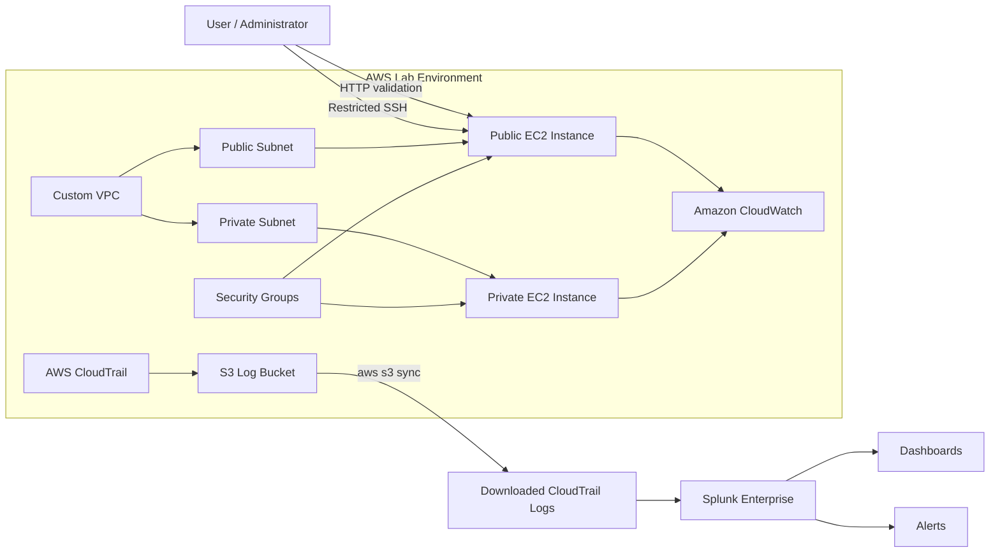

# AWS Hybrid Cloud Security Lab

## Overview

This project demonstrates a hands-on AWS security lab built to model a small hybrid-style cloud environment with segmented networking, monitored workloads, and cloud activity analysis. The lab focuses on a common security problem in cloud environments: infrastructure can be deployed with basic access controls, but defenders still need centralized visibility to understand changes, failed actions, identity activity, and exposed services.

The environment uses a custom AWS VPC with public and private subnets, EC2 instances, security groups, CloudTrail, CloudWatch, S3 log storage, and Splunk Enterprise for SIEM-style analysis. The project shows how AWS infrastructure activity can be collected, parsed, visualized, and turned into basic detections and alerts.

The final lab demonstrates both prevention and detection thinking: network segmentation limits exposure, CloudTrail captures AWS API activity, Splunk dashboards make activity easier to review, and the findings identify where additional logging and hardening would be needed for stronger security operations.

## Key Features

- Built a custom AWS VPC with public and private subnets to demonstrate network segmentation.
- Deployed public and private EC2 instances to validate exposure boundaries.
- Configured security groups to restrict inbound access, including SSH limited to a known public IP.
- Enabled AWS CloudTrail to capture AWS API activity across the lab environment.
- Used Amazon S3 as the storage location for CloudTrail log files.
- Reviewed CloudWatch EC2 metrics to establish basic workload visibility.
- Imported CloudTrail JSON logs into Splunk Enterprise for centralized security analysis.
- Parsed nested CloudTrail records in Splunk using `spath` and `mvexpand`.
- Built Splunk dashboards for AWS API activity, EC2 activity, failed API calls, and service trends over time.
- Created alerts for failed API calls, EC2 state changes, and security group changes.
- Used AWS CLI automation with `aws s3 sync` to bulk retrieve CloudTrail logs from S3.
- Documented security gaps around host-level visibility, SSH exposure, and missing centralized OS logs.

## Architecture

The lab starts with a segmented AWS network. A public subnet hosts an internet-accessible EC2 instance for web validation, while a private subnet hosts an internal EC2 instance without direct public exposure. AWS CloudTrail records control-plane activity and stores logs in S3. Those logs are downloaded with AWS CLI and imported into Splunk Enterprise, where searches, dashboards, and alerts provide security visibility.

## Tools & Technologies

### Cloud / Infrastructure

- AWS VPC
- Public and private subnets
- Internet Gateway
- Route tables
- EC2
- Security Groups
- Amazon S3

### Security Tools

- AWS CloudTrail
- Splunk Enterprise
- Splunk Search Processing Language (SPL)

### Programming / Scripting

- AWS CLI
- Shell-based log retrieval workflow using `aws s3 sync`
- JSON log parsing in Splunk

### Monitoring / Logging

- Amazon CloudWatch EC2 metrics
- CloudTrail event history
- S3-based CloudTrail log storage
- Splunk dashboards and alerts

### Automation / CI/CD

- AWS CLI automation for repeatable CloudTrail log collection
- No CI/CD pipeline was implemented in this lab

## Security Concepts Demonstrated

This project demonstrates core cloud security and security operations concepts, including network segmentation, least privilege access, cloud logging, SIEM integration, detection engineering, and security gap analysis.

The AWS portion shows how public and private subnets, route tables, and security groups affect exposure. The monitoring portion shows how CloudTrail can capture AWS API activity, while also highlighting that CloudTrail does not provide operating system-level visibility such as SSH session details or shell commands.

The Splunk portion demonstrates practical SIEM work: ingesting raw logs, parsing nested JSON records, writing searches, building dashboards, and creating alerts around meaningful cloud activity such as failed API calls, EC2 lifecycle events, and security group changes.

## Implementation Steps

1. Designed a segmented AWS network using a custom VPC, public subnet, private subnet, route tables, and an Internet Gateway.
2. Deployed EC2 instances into public and private network segments to test access boundaries.
3. Configured security groups to allow required access while limiting SSH exposure to a known public IP.
4. Validated that the public web server was reachable over HTTP.
5. Confirmed that the private EC2 instance was not directly exposed to the internet.
6. Enabled CloudTrail to capture AWS API activity and store logs in S3.
7. Reviewed CloudTrail event history and CloudWatch EC2 metrics for baseline visibility.
8. Used AWS CLI to download CloudTrail logs from S3 with `aws s3 sync`.
9. Uploaded CloudTrail JSON logs into Splunk Enterprise.
10. Parsed CloudTrail records with Splunk searches using `spath` and `mvexpand`.
11. Built dashboards for API activity, EC2 activity, failed API calls, and service trends.
12. Created alerts for failed API calls, EC2 state changes, and security group changes.
13. Documented monitoring gaps and recommended improvements.

## Results / Findings

The project produced a working cloud security monitoring workflow that connects AWS infrastructure activity to SIEM analysis in Splunk. CloudTrail logs were collected from AWS, stored in S3, retrieved with the AWS CLI, and analyzed in Splunk using custom parsing and searches.

Dashboards provided visibility into common AWS API actions, infrastructure activity, failed API calls, EC2-related events, and service activity trends over time. Alerts were added for security-relevant events such as failed API calls, EC2 state changes, and security group modifications.

The lab also identified important security gaps. CloudTrail provided strong visibility into AWS control-plane activity, but it did not capture host-level events such as failed SSH login attempts, SSH sessions, or shell commands. The project therefore recommends adding host-level logging, VPC Flow Logs, Session Manager, and centralized log aggregation for deeper detection coverage.

## Screenshots

Suggested screenshots to include:

- `screenshots/vpc-subnet-layout.png`
- `screenshots/route-table-associations.png`
- `screenshots/security-group-rules.png`
- `screenshots/public-web-validation.png`
- `screenshots/cloudtrail-event-history.png`
- `screenshots/s3-cloudtrail-logs.png`
- `screenshots/splunk-cloudtrail-ingestion.png`
- `screenshots/splunk-dashboard-overview.png`
- `screenshots/failed-api-alert.png`
- `screenshots/security-group-change-alert.png`
- `screenshots/architecture.png`

## Challenges & Lessons Learned

- CloudTrail logs contain nested JSON records, so useful Splunk analysis required custom parsing with `spath` and `mvexpand`.
- AWS control-plane logs are valuable for identity and infrastructure monitoring, but they do not replace host-level logging.
- A private subnet reduces direct exposure, but additional controls are still needed for monitoring east-west traffic and instance activity.
- SSH access should be minimized even when restricted by IP; AWS Systems Manager Session Manager would reduce the need for public SSH exposure.
- Security dashboards are most useful when they focus on meaningful events, such as failed actions and infrastructure changes, instead of only high-volume read-only API calls.

## Relevance to Security Roles

This project maps well to Security Engineer, Cloud Security Analyst, SOC Analyst, and Detection Engineer responsibilities. It shows practical experience with AWS infrastructure security, cloud logging, SIEM ingestion, dashboard creation, alert logic, and security gap analysis.

It is also relevant to DevSecOps and cloud operations roles because it demonstrates secure cloud design decisions, repeatable log retrieval with AWS CLI, and recommendations for improving visibility and reducing administrative exposure.

## Future Improvements

- Replace direct SSH access with AWS Systems Manager Session Manager.
- Enable VPC Flow Logs for network-level visibility.
- Add host-level logging from EC2 instances, such as Linux authentication logs.
- Forward logs automatically instead of manually uploading downloaded CloudTrail files.
- Add detection query files to the repository for failed API calls, EC2 state changes, and security group modifications.
- Add sanitized sample CloudTrail events for reviewers to understand the detection logic.
- Include screenshots of AWS architecture, Splunk dashboards, and alert results.
- Add an architecture diagram image under `screenshots/architecture.png`.
- Expand the lab with IAM-specific abuse scenarios, such as suspicious access key creation or privilege escalation attempts.
